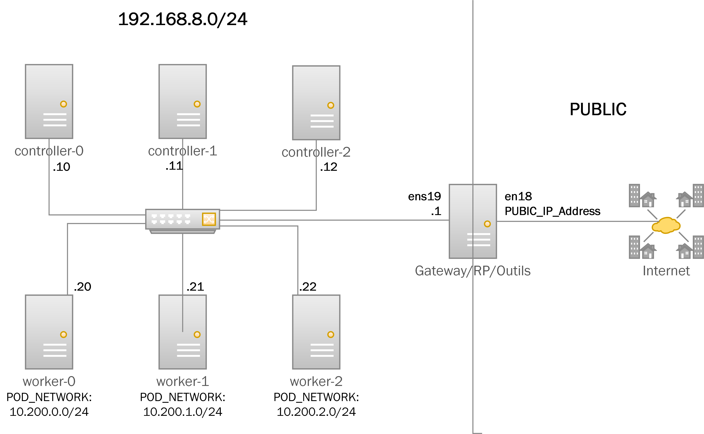

# Kubernetes The Hard Way - Proxmox (KVM)

This tutorial walks you through setting up Kubernetes the hard way. This guide is not for people looking for a fully automated command to bring up a Kubernetes cluster. If that's you then check out [Google Kubernetes Engine](https://cloud.google.com/kubernetes-engine), or the [Getting Started Guides](https://kubernetes.io/docs/setup).

Kubernetes The Hard Way is optimized for learning, which means taking the long route to ensure you understand each task required to bootstrap a Kubernetes cluster.

> The results of this tutorial should not be viewed as production ready, and may receive limited support from the community, but don't let that stop you from learning!

## Overview of the Network Architecture

## Copyright

 This work is licensed under a <a rel="license" href="http://creativecommons.org/licenses/by-nc-sa/4.0/">Creative Commons Attribution-NonCommercial-ShareAlike 4.0 International License</a>.

## Target Audience

The target audience for this tutorial is someone planning to support a production Kubernetes cluster and wants to understand how everything fits together, in particular if you want to use a Proxmox hypervisor (or KVM).

## Cluster Details

Kubernetes The Hard Way guides you through bootstrapping a highly available Kubernetes cluster with end-to-end encryption between components and RBAC authentication.

* [kubernetes](https://github.com/kubernetes/kubernetes) 1.18.4 (kube-apiserver, kube-controller-manager, kube-scheduler and kubectl)
* [containerd](https://github.com/containerd/containerd) 1.3.4
* [coredns](https://github.com/coredns/coredns) v1.6.3
* [cni-plugins](https://github.com/containernetworking/plugins) v0.8.5
* [etcd](https://github.com/coreos/etcd) v3.4.9
* [cri-tools](https://github.com/kubernetes-sigs/cri-tools) 1.17.0

## Labs

This tutorial assumes you have access to a Proxmox hypervisor with at least 25GB free RAM and 140GB free HDD/SSD. While a Proxmox server is used for basic infrastructure requirements the lessons learned in this tutorial can be applied to other platforms (ESXi, KVM, VirtualBox, ...).

* [Prerequisites](docs/01-prerequisites.md)
* [Installing the Client Tools](docs/02-client-tools.md)
* [Provisioning Compute Resources](docs/03-compute-resources.md)
* [Provisioning the CA and Generating TLS Certificates](docs/04-certificate-authority.md)
* [Generating Kubernetes Configuration Files for Authentication](docs/05-kubernetes-configuration-files.md)
* [Generating the Data Encryption Config and Key](docs/06-data-encryption-keys.md)
* [Bootstrapping the etcd Cluster](docs/07-bootstrapping-etcd.md)
* [Bootstrapping the Kubernetes Control Plane](docs/08-bootstrapping-kubernetes-controllers.md)
* [Bootstrapping the Kubernetes Worker Nodes](docs/09-bootstrapping-kubernetes-workers.md)
* [Configuring kubectl for Remote Access](docs/10-configuring-kubectl.md)
* [Provisioning Pod Network Routes](docs/11-pod-network-routes.md)
* [Deploying the DNS Cluster Add-on](docs/12-dns-addon.md)
* [Smoke Test](docs/13-smoke-test.md)
* [Cleaning Up](docs/14-cleanup.md)
