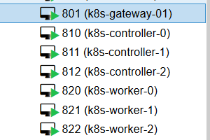
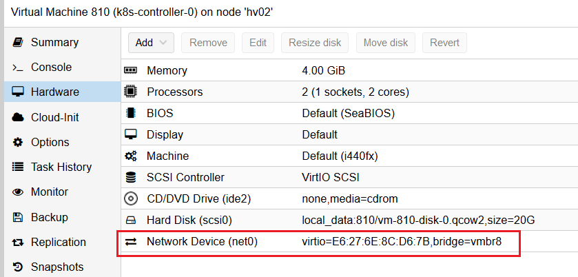

# Prerequisites

## Proxmox Hypervisor

本チュートリアルでは、Kubernetesクラスターのブートストラップに必要な計算資源のプロビジョニングを一から効率的に行うために[Proxmox](https://proxmox.com/en/) を活用しています。代わりにESXi、KVM、Virtualboxあるいはその他のハイパーバイザを使用できます。

> 本チュートリアルに必要な計算資源では少なくとも25GBのRAM、140GBのHDD(SSD)が必要です。

本チュートリアルで使用するVMのリスト:

|名前|役割|vCPU|RAM|Storage (thin)|IP|OS|
|--|--|--|--|--|--|--|
|controller-0|controller|2|4GB|20GB|192.168.8.10/24|Ubuntu|
|controller-1|controller|2|4GB|20GB|192.168.8.11/24|Ubuntu|
|controller-2|controller|2|4GB|20GB|192.168.8.12/24|Ubuntu|
|worker-0|worker|2|4GB|20GB|192.168.8.20/24|Ubuntu|
|worker-1|worker|2|4GB|20GB|192.168.8.21/24|Ubuntu|
|worker-2|worker|2|4GB|20GB|192.168.8.22/24|Ubuntu|
|gateway-01|Reverse Proxy, client tools, gateway|1|1GB|20GB|192.168.8.1/24 + PUBLIC IP|Debian|

Promoxのハイパーバイザ上では、私の環境では`k8s-`というプレフィックスをVMの名前につけました。



## 環境の準備

### ハイパーバイザのネットワーク

本チュートリアルでは、Promox上に2つのネットワークが必要です:

* パブリックネットワークブリッジ(下記スクショにおける`vmbr0`)
* プライベートネットワークブリッジ(下記スクショにおける`vmbr8`)


> 備考: Podネットワークは後で定義します

すべてのKubernetesノード(ワーカー、コントローラー)ではプライベートなKubernetesネットワーク(`vmbr8`)だけが必須要件です。



リバースプロキシ、クライアントツール、ゲートウェイ用VMをでは2つのネットワークインターフェースが必要です。1つはKubernetesで使用するプライベートネットワーク(`vmbr8`)、もう1つはパブリックなネットワーク(`vmbr0`)です。


### ネットワーク設計

This diagram represents the network design:


> やってみたければ、IPv6スタック構成を定義しても構いません。

### Gateway VMの設置

> このVM設置プロセスはチュートリアルにおける主目的ではありません。
>
> 今回はチュートリアルのため、IPv6スタックは設定しませんが、ご自身で追加で設定する分には構いません。

このVMではプライベートなKubernetesネットワークのためにリバースプロキシ及びクライアントツールとしてNATゲートウェイを使います。

つまり、証明書の生成などを含むすべてのクライアント側手順は基本的にはこのVM上で行います(本チュートリアルにおける次のステップ)。

事前準備として以下のことを行ってください:

* VMに最新の[amd64 Debian netinst image](https://www.debian.org/CD/netinst/)をインストールします。

* NICをネットワーク設計どおりに設定します。`/etc/network/interfaces`ファイルの一例は、パブリックIFがens18でプライベートIFがens19であれば以下のようになります(`PUBLIC_IP_ADDRESS`、`MASK`及び`PUBLIC_IP_GATEWAY`はご自身で置き換えてください):

```bash
source /etc/network/interfaces.d/*

# The loopback network interface
auto lo
iface lo inet loopback

# The public network interface
auto ens18
allow-hotplug ens18
iface ens18 inet static
        address PUBLIC_IP_ADDRESS/MASK
        gateway PUBLIC_IP_GATEWAY
        dns-nameservers 9.9.9.9

# The private network interface
auto ens19
allow-hotplug ens19
iface ens19 inet static
        address 192.168.8.1/24
        dns-nameservers 9.9.9.9
```

> やってみたければ、IPv6スタック構成を定義しても構いません。
>
> 必要であれば、DNSリゾルバを他のものにしても構いません。

* VMのホスト名を定義します:

```bash
sudo hostnamectl set-hostname gateway-01
```

* パッケージリストを最新化し、システムを最新にします:

```bash
sudo apt-get update && sudo apt-get upgrade -y
```

* Install SSH, vim, tmux, curl, NTP and iptables-persistent:

```bash
sudo apt-get install ssh vim tmux curl ntp iptables-persistent -y
```

* SSH及びNTPサービスを有効化します:

```bash
sudo systemctl enable ntp
sudo systemctl start ntp
sudo systemctl enable ssh
sudo systemctl start ssh
```

* IPルーティングを有効化します:

```bash
sudo echo 'net.ipv4.ip_forward=1' >> /etc/sysctl.conf
sudo echo '1' > /proc/sys/net/ipv4/ip_forward
```

> やってみたければ、IPv6スタック構成を定義しても構いません。

* NAT構成とポート開放のためにiptablesを設定します。 `/etc/iptables/rules.v4`の一例は、パブリックIFがens18でプライベートIFがens19であれば以下のようになります:

```bash
# Generated by xtables-save v1.8.2 on Fri Jun  5 16:45:02 2020
*nat
-A POSTROUTING -o ens18 -j MASQUERADE
COMMIT

*filter
-A INPUT -i lo -j ACCEPT
# allow ssh, so that we do not lock ourselves
-A INPUT -i ens18 -p tcp -m tcp --dport 22 -j ACCEPT
-A INPUT -i ens18 -p tcp -m tcp --dport 80 -j ACCEPT
-A INPUT -i ens18 -p tcp -m tcp --dport 443 -j ACCEPT
-A INPUT -i ens18 -p tcp -m tcp --dport 6443 -j ACCEPT
-A INPUT -i ens18 -p icmp -j ACCEPT
# allow incoming traffic to the outgoing connections,
# et al for clients from the private network
-A INPUT -m state --state RELATED,ESTABLISHED -j ACCEPT
# prohibit everything else incoming
-A INPUT -i ens18 -j DROP
COMMIT
# Completed on Fri Jun  5 16:45:02 2020
```

> やってみたければ、IPv6スタック構成を定義しても構いません。

* iptablesのルールをリストア/アクティブにするには以下を実行します:

```bash
sudo iptables-restore < /etc/iptables/rules.v4
```

* `/etc/hosts`を以下のように設定します(`PUBLIC_GW_IP`はご自身で置き換えてください):

```bash
127.0.0.1       localhost
PUBLIC_GW_IP    gateway-01.external gateway-01

# The following lines are desirable for IPv6 capable hosts
::1     localhost ip6-localhost ip6-loopback
ff02::1 ip6-allnodes
ff02::2 ip6-allrouters

192.168.8.10    controller-0
192.168.8.11    controller-1
192.168.8.12    controller-2

192.168.8.20    worker-0
192.168.8.21    worker-1
192.168.8.22    worker-2
```

* ネットワーク構成を確認するために、VMの再起動を実施し、アクティブなIPアドレスを確認します:

```bash
sudo reboot
```

### Kubernetesノード用VMの設置

> このVM設置プロセスはチュートリアルにおける主目的ではありません。
>
> 今回はチュートリアルのため、IPv6スタックは設定しませんが、ご自身で追加で設定する分には構いません。

これらのVMはKubernetesノード(コントローラー及びワーカー)に使われます。

基本的なVM構成プロセスは6台ともすべて同じです(1台を構成し、クローン後に各VMでIPアドレスをアドレスとホスト名を変更することもできます)。

事前準備として以下のことを行ってください:

* [Ubuntu 20.04.3 LTS (Bionic Beaver) Server install image](https://releases.ubuntu.com/20.04/)をVM上にインストールします。

* NICをネットワーク設計どおりに設定します。`/etc/network/interfaces`ファイルの一例は、パブリックIFがens18でプライベートIFがens19であれば以下のようになります(`PUBLIC_IP_ADDRESS`、`MASK`及び`PUBLIC_IP_GATEWAY`はご自身で置き換えてください):

```bash
# This is the network config written by 'subiquity'
network:
  ethernets:
    ens18:
      addresses:
      - 192.168.8.10/24
      gateway4: 192.168.8.1
      nameservers:
        addresses:
        - 9.9.9.9
  version: 2
```

> やってみたければ、IPv6スタック構成を定義しても構いません。
>
> 必要であれば、DNSリゾルバを他のものにしても構いません。

* VMのホスト名を定義(以下はcontroller-0での例):

```bash
sudo hostnamectl set-hostname controller-0
```

* パッケージリストを最新化し、システムを最新にします:

```bash
sudo apt-get update && sudo apt-get upgrade -y
```

* Install SSH and NTP:

```bash
sudo apt-get install ssh ntp -y
```

* SSH及びNTPサービスを有効化します:

```bash
sudo systemctl enable ntp
sudo systemctl start ntp
sudo systemctl enable ssh
sudo systemctl start ssh
```

* `/etc/hosts`を設定します。以下はcontroller-0の場合の例です(`PUBLIC_GW_IP`はご自身で置き換えて、各VMに反映してください。):

```bash
127.0.0.1 localhost
127.0.1.1 controller-0

# The following lines are desirable for IPv6 capable hosts
::1     ip6-localhost ip6-loopback
fe00::0 ip6-localnet
ff00::0 ip6-mcastprefix
ff02::1 ip6-allnodes
ff02::2 ip6-allrouters

PUBLIC_GW_IP    gateway-01.external
192.168.8.1     gateway-01

192.168.8.11    controller-1
192.168.8.12    controller-2

192.168.8.20    worker-0
192.168.8.21    worker-1
192.168.8.22    worker-2
```

* ネットワーク構成を確認するために、VMの再起動を実施し、アクティブなIPアドレスを確認します:

```bash
sudo reboot
```

## tmuxを使った並列なコマンド実行

[tmux](https://github.com/tmux/tmux/wiki)を使用すると、複数のcomputeインスタンスで同時にコマンドを実行できます。本チュートリアルでは、同じコマンドを複数のコンピュートインスタンスで実行する必要がある場合があります。その場合、tmuxを使用して、プロビジョニングプロセスを高速化するために同期を有効にした複数のペインにウィンドウを分割することを検討してください。

> tmuxの使用はオプションであり、このチュートリアルを完了するために必須ではありません。


> Enable synchronize-panes by pressing `ctrl+b` followed by `shift+:`. Next type `set synchronize-panes on` at the prompt. To disable synchronization: `set synchronize-panes off`.

Next: [クライアントツールのインストール](02-client-tools.md)
